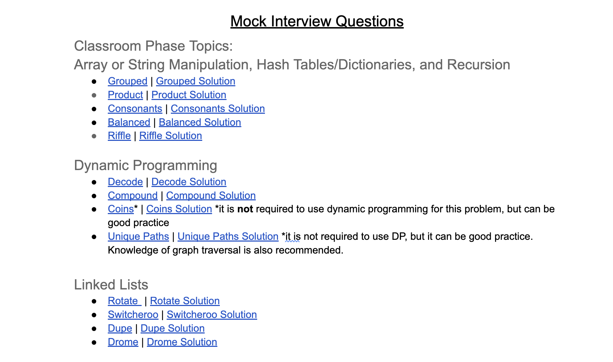

# About Mock Interviews

<iframe src="https://adaacademy.hosted.panopto.com/Panopto/Pages/Embed.aspx?id=548cfc0e-cc71-4262-aeb3-afc70150e63c&autoplay=false&offerviewer=true&showtitle=true&showbrand=true&captions=true&interactivity=all" height="405" width="720" style="border: 1px solid #464646;" allowfullscreen allow="autoplay"></iframe>

<!-- available callout types: info, success, warning, danger, secondary, star  -->
### !callout-success

## Please Watch Before Your First Mock Interview

Please watch the above video before your first mock interview so that you know what to expect going in. If you have any questions about the format, reach out in the `#unit-4-general` channel with your question.

### !end-callout

As part of Unit 4, you are required to complete five peer-to-peer mock interviews on topics covered in both the Classroom CS Fundamentals and Unit 4. Mock interviews should be conducted in 90 minute sessions with a partner.

## Mock Interview Questions

[**Mock Interview Question Repository**](https://docs.google.com/document/d/1SmKIpGL_z_IXhgLiaGAf3kPc_bApgH1LtIGcXVoKUHE/edit?usp=sharing)

For your five required mock interviews, we ask that you use Ada provided questions accessible via the link above. This is to ensure questions are of an appropriate scope and topic. We encourage you to explore non-Ada interview questions in your own time!

**DO NOT VIEW THE PROBLEMS BEFOREHAND**
In order to simulate a real interview experience, please do not preview the questions beforehand. 

When you enter the mock interview, you may choose one or more topics for your interviewer to select your question from. The topics are:
- Classroom Phase (Variables & Memory, Big O, Lists, Hash Tables, Recursion)
- Dynamic Programming
- Linked Lists
- Binary Search Trees
- Graphs - Breadth First & Depth First Search
- Graphs - Hidden Graphs & Dijkstra's

## Mock Interview Structure
At the start of a mock interview, each participant should communicate which of the topics they are comfortable interviewing in to their partner. 

Each person should then choose an interview question for their partner by selecting a question from the [Mock Interview Question Repository](https://docs.google.com/document/d/1SmKIpGL_z_IXhgLiaGAf3kPc_bApgH1LtIGcXVoKUHE/edit?usp=sharing) that is listed under their partner's chosen category(s). If someone receives a question that they have already observed or interviewed with, they should ask their partner to select a different question from their chosen categories. 

Each person should then take approximately 10 minutes to read over the provided _solution_ to the their partner's problem. 

Then each participant should take turns posing as interviewer and interviewee. Each person should have about 40 minutes to attempt their question.

During these sessions, please make an effort to treat it as if it were a real interview space. While we recognize this may feel uncomfortable, learning goals for mock interviews include not only practicing CS Fundamentals topics in an interview setting, but also learning to sit with the discomfort and anxiety that often accompanies interviews. That being said, mock interviews are also a _practice_ space. Leave room to make mistakes, ask questions, and learn from your partner. 

Feel free to optionally add a behavioral question at the top of the interview. If a partner finishes early, consider discussing time and space complexity and/or completing one of the challenges offered at the bottom of the solution guide. You may also choose to leave the session early if you both finish before the 90 minute time mark. 

We encourage you not to extend past 90 minutes as real technical interviews will be time boxed. If you do not complete your question, that's 100% okay and very common for a technical interview! Feel free to finish the problem on your own time if interested. 

### Example Mock Interview Flow

For example, say Monica and Teneika are partnered together. Monica might tell Teneika he is comfortable doing their interview on a question from the Classroom Phase or Dynamic Programming topic. Teneika might tell Monica that she would like to do a Linked Lists interview question topic for their session. 

Monica might choose to have Teneika attempt the *Balanced* problem listed under the Classroom Phase topic in the [Mock Interview Question Repository](https://docs.google.com/document/d/1SmKIpGL_z_IXhgLiaGAf3kPc_bApgH1LtIGcXVoKUHE/edit?usp=sharing) pictured below.

Teneika might choose to have Monica attempt the *Switcheroo* problem listed under the Linked List topic in the Mock Interview Question Repository. Perhaps Monica has already seen a previous mock interview partner implement *Switcheroo* problem, in which case he can ask Teneika to select a different problem. Teneika might then choose to have Monica attempt the *Drome* problem instead. 

Next, Monica will take about ten minutes to read over the *Balanced Solution* and Teneika will read over the *Drome Solution*. 

After both Monica and Teneika have read over the sample solution to their partner's problem, they can begin the actual interview portion. Monica might pose as interviewee first and Teneika will pose as Monica's interviewer. Monica will create a fork of the original *Drome* Replit and share his screen with Teneika. 

Monica will read over the *Drome* problem statement and ask any clarifying questions he has to Teneika. Then Monica will start pseudocoding and implementing his solution to *Drome*. After 40 minutes, Monica and Teneika should wrap up Monica's interview, *even if Monica has not reached a full solution*. If Monica successfully implements his solution before the 40 minute mark, Teneika can ask Monica to evaluate the time and space complexity of his solution, refactor his solution, and/or complete the challenge questions at the bottom of the *Drome Solution*. 

After Monica's interview is complete, Teneika will become the interviewee and attempt to implement the *Balanced* problem. Once both partners have completed their interview, the mock interview session is complete! 

Monica and Teneika should document their session by filling out a [Mock Interview Retrospective in Learn](../01/mock-interview-1-submission.md).

## Graduation Requirements

To graduate, you must complete 5 mock interviews. Over the span of the five interviews you must
- Have at least three different interview partners
- Complete interviews in at least three different topics
- Use Ada provided questions

After each mock interview, please submit a mock interview retrospective via the Learn checkpoints we have provided you. 

The variety of partners requirement is to encourage you to experience different styles of interviewers and observe different folks' problem solving strategies. The variety of topics requirement is to encourage you to practice multiple topics that may arise when you begin your job search. 

## Scheduling Mock Interviews
Ada provides 100 minute instructor facilitated mock interview sessions every other week for each section. During the first ten minutes, instructors will split you into random pairs based on the topics you would like to interview in that day.  **You must arrive within the first five minutes** of the scheduled session in order to be guaranteed a partner. 

Check the [Unit 4 Calendar](https://calendar.google.com/calendar/embed?src=c_d44b988d1234b8420687c70615bd50ffa62ce2e2baa05abafa03c0998d2ebd64%40group.calendar.google.com&ctz=America%2FLos_Angeles) to view available Ada facilitated mock interview session:

If you would like to schedule your own sessions, you are free to coordinate with your fellow Adies and organize alternative sessions. Consider finding partners by posting a request in the `#cs-fun-study-hall` channel on Slack.

## Reminders
- It's **100% okay** not to finish the problem in the allotted time. 
- Your solution does not have to match the sample solution. There are many ways to solve these problems!
  - Because we cannot anticipate every possible solution, the sample solution only provides one possible solution
  - If you are an interviewer and are unsure how to help your interviewee because they are choosing an approach that does not match the sample solution, that's okay! Industry interviewers are sometimes unable or unwilling to provide assistance to the interviewee in a real technical interview. You may also consider looking up alternative solutions online.
- It's okay if you struggle to find a starting point and make progress towards a solution. Consider how you can still show your interviewer what you do know and present yourself in a positive light. 
  - Is there a subproblem or similar problem you can make progress towards solving?
  - Can you develop a set of tests (input/output) to demonstrate your understanding of the problem?
  - Can you pseudocode a solution or partial solution?
  - Consider asking if your interviewer is willing to engage in a collaborative approach
  - There is still value in sitting through an interview where you have no idea how to approach the problem and coming out the other end!
- It's okay if your partner wants to interview in a topic you aren't familiar with (Ex. They want to do an interview on a linked lists question but you haven't reviewed the linked lists lesson yet). 
  - Again, model the type of industry interviewer that is unable or unwilling to provide assistance to the the interviewee. 
  - Assist your partner by reminding them of the general progress making tips included above for interviewees who are struggling to make progress.
  - Provide your partner with feedback on their behavioral and code style skills. 
    - Does your partner clearly communicate their code as they make progress?
    - Does your partner demonstrate good code style?
    - Does your partner demonstrate strong debugging skills?
- Be kind to each other! Wherever possible, help your partner with hints as needed.
- **Remember**: At the bottom of the solution repls there is extra information for the interviewer. It contains:
  - Answers to clarifying questions your partner might ask
  - Suggestions on hints you can give if needed